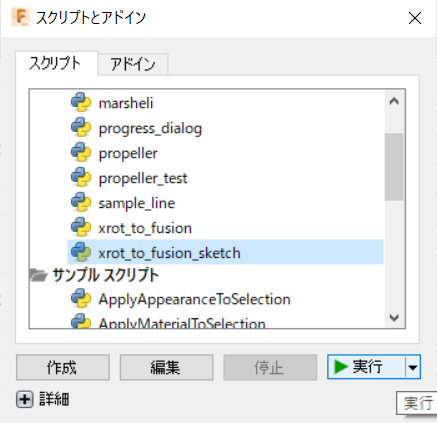
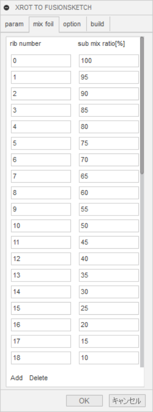
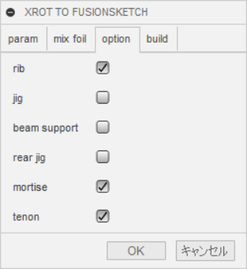

-----------
# プロペラ設計補助ツール
-----------
# 概要
このレポジトリに、プロペラ設計を補助するスクリプトをまとめました。
- xrot_to_vs : [xrotor](http://web.mit.edu/drela/Public/web/xrotor/)によるプロペラ設計ファイルから自動図面化(VectorScript)
- xrot_to_fusion_sketch : [xrotor](http://web.mit.edu/drela/Public/web/xrotor/)によるプロペラ設計ファイルから[fusion360](https://www.autodesk.co.jp/products/fusion-360/overview)で図面のスケッチ生成、UI有り
- aero_for_xrot : [xflr5](http://www.xflr5.tech/xflr5.htm)の翼型解析を[xrotor](http://web.mit.edu/drela/Public/web/xrotor/)のaeroファイルに自動変換

# 使い方
## xrot_to_fusion_sketch
### 準備
#### 手順1
`Autodesk Fusion 360\API\Scripts`フォルダの中に`xrot_to_fusion_sketch`フォルダを貼り付けます。

このフォルダは、私の場合`C:\Users\AccoutName\AppData\Roaming\Autodesk\Autodesk Fusion 360\API\Scripts`に入ってました。
#### 手順2
fusion360を開きアドインをクリックします。


#### 手順3
手順1で入れたスクリプト`xrot_to_fusion_sketch`が反映されているので、選択して実行ボタンをクリックします。



すると入力ダイアログが出現します。

入力方法については次の項目で説明します。

### 入力
入力ダイアログでは以下の3つの項目を設定できます。
- param : 桁穴の大きさや治具の高さなどを指定
- mix foil : 翼型の混合比率を指定
- option : 出力するパーツを指定
#### param

- xrotor_restartfile : xrotorのsaveコマンドで得られる設計ファイル(restartfile)
- main_foil_path : ペラ中央に使う翼型のdatファイルパス
- sub_foil_path : ペラ根、端で使う翼型のdatファイルパス
上記3つは下のimportボダンで参照可能
- hub_radius : ハブ半径[mm]
- rib_interval : リブ間隔[mm]
- rib_center : 桁穴を通す位置(百分率)
- beam_support_interval : 桁の支柱をリブ何個ごとに配置するか
- beam_tepa : 桁のテーパ
- hole_center : 桁を回転中心まで伸ばすと仮定したときの、桁直径
- beam_height : 桁を支える高さ
- jig_width : 治具の幅(土台の横幅)
- frame_height : 土台の縦幅
#### mix foil


指定がなければ、main_foil_pathに指定した翼型のみで出力される。

rib numberに指定したリブ番号については、\
main_foil : sub_foil = 1 - sub mix ratio : sub mix ratio\
の割合で混合されます。

- rib number : sub_foilを混合するリブ番号
- sub mix ratio : sub_foilの混合する割合(%)
#### option

- rib : リブ
- jig : 治具
- beam support : 桁支柱
- rear jig : 後縁治具
- mortise : ほぞ穴
- tenon : ほぞ

チェックを入れたパーツのみが出力されます。
### 実行


buildボタンを押すと入力に応じた図面が出力されます。
## xrot_to_vs
プログラム先頭の
```
#=======================================================================
#--------------------------------入力部分--------------------------------
#=======================================================================
# リブのオフセット(バルサの場合、外皮の厚み分)[mm]
rib_offset = 1
~
~
# フレーム高さ[mm]
frame_hei = 80
#=======================================================================
#--------------------------------入力終了--------------------------------
#=======================================================================
```
を書き換えて使用します。
## aero_for_xrot
準備中
