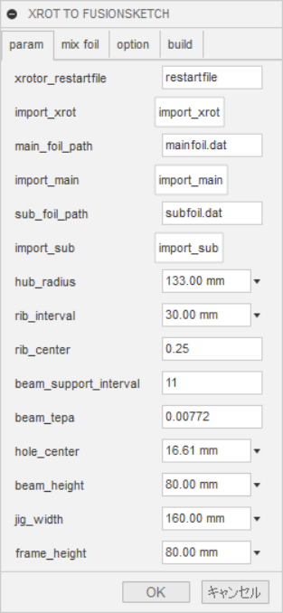
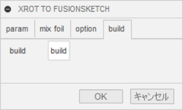

-----------
# プロペラ設計補助ツール
-----------
# 概要
このレポジトリに、プロペラ設計を補助するスクリプトをまとめた。
- xrot_to_vs : [xrotor](http://web.mit.edu/drela/Public/web/xrotor/)によるペラ設計ファイルから自動図面化(VectorScript)
- xrot_to_fusion_sketch : [xrotor](http://web.mit.edu/drela/Public/web/xrotor/)によるペラ設計ファイルから自動図面化([fusion360](https://www.autodesk.co.jp/products/fusion-360/overview))、UI有り
- aero_for_xrot : [xflr5](http://www.xflr5.tech/xflr5.htm)の翼型解析を[xrotor](http://web.mit.edu/drela/Public/web/xrotor/)のaeroファイルに自動変換

# 使い方
## xrot_to_vs
プログラム先頭の
```
#=======================================================================
#--------------------------------入力部分--------------------------------
#=======================================================================
# リブのオフセット(バルサの場合、外皮の厚み分)[mm]
rib_offset = 1
~
~
# フレーム高さ[mm]
frame_hei = 80
#=======================================================================
#--------------------------------入力終了--------------------------------
#=======================================================================
```
を書き換えて使用する
## xrot_to_fusion_sketch
### 準備
#### 手順1
`Autodesk Fusion 360\API\Scripts`フォルダの中に`xrot_to_fusion_sketch`フォルダを貼り付けます。

このフォルダは、私の場合`C:\Users\AccoutName\AppData\Roaming\Autodesk\Autodesk Fusion 360\API\Scripts`に入ってました。
#### 手順2
fusion360を開きアドインをクリック


#### 手順3
手順1で入れたスクリプト`xrot_to_fusion_sketch`が反映されているので、選択して実行ボタンをクリック


すると入力ダイアログが出現します。

入力方法については次の項目で説明します。

### 入力
入力ダイアログでは以下の3つの項目を設定できます。
- param : 桁穴の大きさや治具の高さなどを指定
- mix foil : 翼型の混合比率を指定
- option : 出力するパーツを指定
#### param

#### mix foil

#### option

### 実行

## aero_for_xrot
準備中
